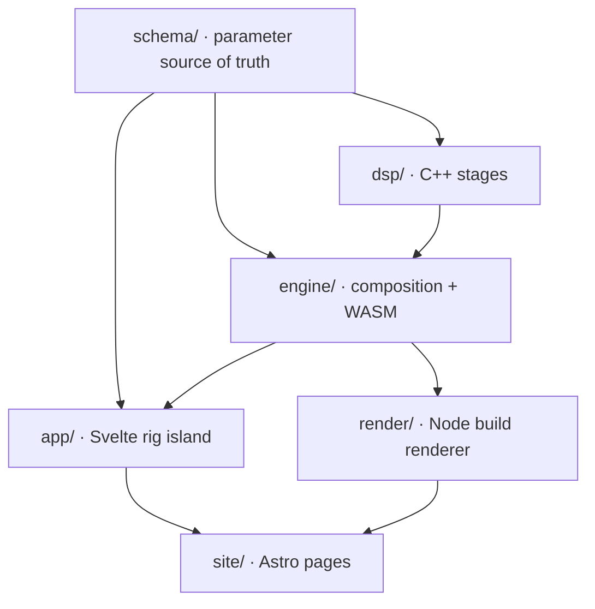
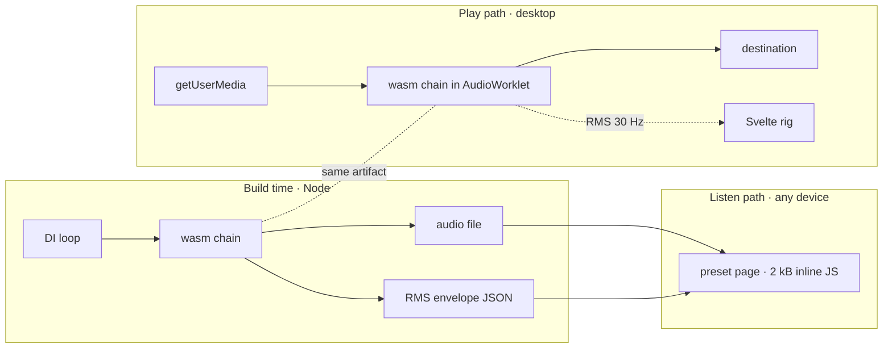
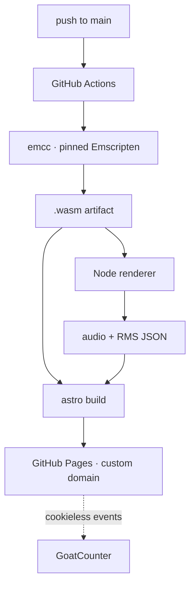

# Architecture Spine — Tonecraft v1

## Design Paradigm

**Pipes-and-filters, composed twice over one set of stages.**

The signal chain is an ordered sequence of stages with a uniform block interface. Each stage is a C++ module with a flat C surface; none of them knows what precedes or follows it. The chain is composed exactly twice — once at build time from Node, once at runtime in the AudioWorklet — over the *same compiled stages*. The two load paths of the product are two compositions, not two implementations.

| Layer | Directory | Owns |
| --- | --- | --- |
| Schema | `schema/` | Parameter definitions. Depends on nothing. |
| Stages | `dsp/` | One C++ module per stage, flat C interface. |
| Composition | `engine/` | Chain assembly, WASM lifetime, parameter bridge, meter reader. |
| Rig | `app/` | The Svelte island. Knows parameters, never DSP. |
| Pages | `site/` | Astro static output, i18n, preset pages, guides. |
| Renderer | `render/` | Node harness that drives the same WASM offline. |



Dependencies point one way only. `dsp/` never imports TypeScript. `app/` never imports `dsp/`. `site/` never imports `engine/`.

## Invariants & Rules

### AD-1 — One processor holds the whole chain

- **Binds:** FR-14, FR-15, NFR-1
- **Prevents:** a node-per-effect graph, where every boundary is a buffer copy and metering spans contexts.
- **Rule:** all audio processing lives in a single `AudioWorkletProcessor`. No `AudioNode` sits between the input and the output except the nodes required to reach the worklet itself.

### AD-2 — Non-linear stages are contiguous

- **Binds:** FR-16, NFR-1
- **Prevents:** a second polyphase resampling chain, and an oversampled block that does not alias.
- **Rule:** every non-linear stage (drive waveshaper, neural amp) occupies one uninterrupted region of the chain. Exactly one 4x oversampling window wraps that region. No linear stage may be placed inside it, and no future reordering may split it.

### AD-3 — The cab is a direct-form FIR inside the worklet

- **Binds:** FR-6, FR-14, NFR-6
- **Prevents:** a cab that renders differently in each browser, and a convolution implementation written twice.
- **Rule:** impulse-response convolution is a SIMD direct-form FIR compiled into the WASM module. `ConvolverNode` is not used anywhere. IRs are capped at 2048 taps; a longer IR requires revisiting this decision, not silently switching algorithm.

### AD-4 — Deterministic floating point

- **Binds:** NFR-6, NFR-16
- **Prevents:** the same tone state rendering differently per engine, which would make every shared link lie.
- **Rule:** compile with `-msimd128`. `-mrelaxed-simd` is forbidden — it is defined to permit engine-specific rounding. `-mfma` is permitted only in its deterministic emulated form. No fast-math, no reassociation, no denormal flushing that differs per target.

### AD-5 — Quality is fixed at build time `[ADOPTED]`

- **Binds:** FR-17, NFR-6
- **Prevents:** a runtime quality ladder chosen from measured headroom.
- **Rule:** model complexity, oversampling factor and filter orders are compile-time constants chosen for the floor machine. Nothing in the audio path reads a performance measurement and changes behaviour.

### AD-6 — One renderer, two triggers

- **Binds:** FR-1, FR-6, FR-33
- **Prevents:** a demo that sounds better than the real-time path.
- **Rule:** build-time renders load the identical `.wasm` artifact the browser loads, driven from Node. There is no second implementation, no native build of the chain, and no separate "offline quality" configuration. The runtime `OfflineAudioContext` fallback composes the same stages through the same worklet.

### AD-7 — The parameter schema is the only source of truth

- **Binds:** FR-19, FR-28, NFR-17
- **Prevents:** a C++ constant and a TypeScript constant drifting apart silently.
- **Rule:** `schema/` declares every parameter with its id, unit, range, default and taper. The C++ header is generated from it in the build; a hand-edited generated header fails the build. No parameter exists that is not in the schema.

### AD-8 — The schema is append-only, forever

- **Binds:** FR-29, FR-30
- **Prevents:** a shared link dying, which kills a branch of the only growth loop v1 has.
- **Rule:** parameters may be added. They may never be removed, renamed, reordered in the wire format, or have their meaning or unit changed. A retired parameter is marked deprecated and ignored by the engine; its id is never reused.

### AD-9 — Tone state is stored in engineering units

- **Binds:** FR-28, FR-29, FR-30
- **Prevents:** a UI redesign or a retuned fader taper silently changing how every previously shared tone sounds.
- **Rule:** the serialised chain state carries physical values — dB, Hz, ratio, milliseconds. Never normalised fader positions. Taper curves are a presentation concern owned by `app/` and are never part of the wire format.

### AD-10 — A tone link pins the engine identity

- **Binds:** FR-29, NFR-6
- **Prevents:** identical parameters through revised weights producing a different sound years later.
- **Rule:** the serialised state includes the amp id and its weights version. Every weights version ever shipped stays served at a stable URL, indefinitely. A weights fix is a new version, never an overwrite.

### AD-11 — The main thread owns state; the worklet owns nothing

- **Binds:** FR-19, FR-27, FR-32
- **Prevents:** two sources of truth, and a state read that requires an audio-thread round trip.
- **Rule:** chain state lives in main-thread stores. The worklet is a sink for parameters and a source only for measurement. `localStorage`, the URL hash and the tone file are projections of that store. Nothing reads state back out of the worklet.

### AD-12 — Metering is one-way and lossy-tolerant

- **Binds:** FR-24, FR-25, NFR-4
- **Prevents:** the visualisation coupling itself to audio correctness.
- **Rule:** per-stage RMS is written to a pre-allocated `Float32Array` and posted at 30 Hz. Dropping, reordering or never receiving a metering frame must not affect audio, state or correctness anywhere. Metering suspends when the tab is hidden. The worklet is also the only detector of dropouts (FR-35); the main thread never infers one from a gap it observes.

### AD-13 — The audio thread cannot allocate and cannot fail

- **Binds:** FR-15, FR-18, NFR-1
- **Prevents:** a garbage-collection pause or an error path turning into an audible glitch.
- **Rule:** `process()` performs no allocation, no I/O, no logging and no DOM access. Compiled `-fno-exceptions -fno-rtti`, the flat C interface returns status codes; every failure is resolved at init. `process()` always produces audio — silence at worst, never nothing.

### AD-14 — Model weights are loadable content

- **Binds:** FR-17, NFR-2
- **Prevents:** an amp becoming a compilation target, which would break the lazy-loaded amps already on the roadmap.
- **Rule:** weights ship as a binary Float32 blob with a short header, loaded into RTNeural at init. Not embedded in the WASM, not JSON. The default preset's weights are inside the first-interactive budget; every other amp is fetched on demand.

### AD-15 — No build output is committed

- **Binds:** FR-1, FR-6, FR-46
- **Prevents:** a `.wasm` and the audio files rendered from it drifting apart, and binaries accumulating in git history forever.
- **Rule:** CI compiles the WASM with a pinned Emscripten, runs the renders, and deploys. `.wasm`, rendered audio and RMS envelope JSON are never committed. Source assets — IRs, weights, the DI loop — are.

### AD-16 — The listen path shares no runtime code with the play path

- **Binds:** FR-2, FR-3, FR-5, NFR-9
- **Prevents:** the engine reaching a preset page through a shared import, which is how a "no JS" page acquires 300 kB.
- **Rule:** a preset page ships at most 2 kB of inline vanilla JavaScript — a play control and the cord animation driven from `audio.currentTime`. No framework, no hydration, no `AudioContext`, no WASM, no microphone permission. The page imports nothing from `engine/` or `app/`. The budget is enforced at build time and fails the build.

### AD-17 — Static hosting, no exceptions `[ADOPTED]`

- **Binds:** FR-46, NFR-16
- **Prevents:** an architecture that quietly requires a header the host cannot send.
- **Rule:** everything is a static file on GitHub Pages. No server, no serverless function, no database, no custom HTTP header. Therefore no `SharedArrayBuffer`, no WASM threads, no COOP/COEP, no cross-origin isolation, and no `coi-serviceworker`.

### AD-18 — The chain runs at one fixed internal rate

- **Binds:** FR-6, FR-9, FR-17, NFR-6
- **Prevents:** the same tone sounding different to a user on a 44.1 kHz interface than to one on 48 kHz — a divergence that arrives through the device, which no other invariant watches.
- **Rule:** every stage is designed for, and runs at, one internal design rate: 48 kHz. Model weights, half-band filter coefficients and the cab FIR are all defined at that rate and at no other. When the device runs at another rate, `engine/` converts explicitly at the chain boundary with our own deterministic resampler — never the browser's implicit one, which FR-9 exists to avoid. A stage may not read the device rate; it may not have a rate parameter at all.

### AD-19 — One block contract for every stage

- **Binds:** FR-14, FR-15, FR-16
- **Prevents:** two stages that cannot be composed — one in-place, one out-of-place — and disagreement about how many frames a call carries.
- **Rule:** a stage is `void process(const float* in, float* out, uint32_t frames)`, mono `float32`, never in place, buffers never aliasing. `frames` is 128 outside the oversampling window and 512 inside it. A stage never allocates, never stores a pointer it was passed, and never assumes `frames` is constant across calls.

### AD-20 — Exactly one layer smooths parameters

- **Binds:** FR-19, FR-27
- **Prevents:** double smoothing, which is sluggish and inconsistent between stages, and its opposite, which zippers.
- **Rule:** continuous parameters are smoothed once, by `AudioParam` interpolation at the worklet boundary. A `dsp/` stage receives an already-smoothed value and must add no smoothing of its own. A stage deriving coefficients recomputes them per block from the value it was handed.

### AD-21 — Meter slots and bypass are declared, never positional

- **Binds:** FR-20, FR-24, AD-8
- **Prevents:** inserting a stage silently shifting every meter slot and every bypass flag by one, with no error anywhere because the array is still the right length.
- **Rule:** each stage declares a stable meter slot id and a stable bypass parameter id in `schema/`. Nothing addresses a stage by its index in the chain. Adding a stage takes the next id; ids are never reused (AD-8).

## Consistency Conventions

| Concern | Convention |
| --- | --- |
| Naming | Files `kebab-case`; Svelte components `PascalCase.svelte`; C++ one module per stage, `snake_case`; parameter ids `snake_case`, stable forever (AD-8). |
| Generated code | Any generated file carries a header naming its generator and is excluded from manual edit; regenerating in CI must produce no diff. |
| Data & formats | Tone state: engineering units (AD-9). Link: base64url of a packed binary layout in the URL hash. File: JSON with the same field names as the schema, plus `schemaVersion`, `ampId`, `weightsVersion`. Weights: `[u32 magic][u32 version][u32 count][f32 ...]`. |
| Units | dB for level, Hz for frequency, milliseconds for time, 0..1 only for mix. Never a bare number. |
| Errors | Audio thread: status codes, never exceptions (AD-13). UI: cause in one sentence, fix in one sentence, never blocking. |
| Config | Compile-time DSP constants live in `schema/`, not in `dsp/`. Nothing in the audio path reads runtime configuration. |
| Logging | None in the audio thread, ever. Measurement leaves via the meter channel (AD-12) or the analytics events (FR-47). |
| i18n | Every user-visible string in FR and EN from the first commit. No string literal in a component. |

## Stack

Verified against the web on 2026-09-02.

| Name | Version |
| --- | --- |
| Astro | 7.2.x |
| Svelte | 5.57.x |
| Vite | bundled with Astro 7 |
| TypeScript | 6.0.x, `strict` |
| nanostores | 1.5.x |
| Tailwind CSS | 4.3.x |
| Emscripten | 6.0.x, pinned exactly in CI |
| RTNeural | 1.0.0, header-only, compile-time API |
| Node | 24 LTS (Krypton), build and render only |
| GoatCounter | hosted, cookieless, custom events |
| GitHub Pages + Actions | — |

Compile flags: `-O3 -msimd128 -flto -fno-exceptions -fno-rtti`. Never `-mrelaxed-simd` (AD-4).

## Structural Seed

### The two compositions



### The chain and its oversampling window


Only `Drive` and `Amp` run at 4x. `Gate`, `Cab`, `Reverb` and `Limiter` never do (AD-2).

### Deployment and environments

One environment: production. There is no staging, because there is no server to stage.



Rollback is a revert and a rebuild — the deployed output is a pure function of the commit. The only capacity ceiling is Pages bandwidth, roughly 100 GB/month.

### Source tree

```text
tonecraft/
  schema/            # parameter definitions — depends on nothing
    params.ts        # the source of truth
    generate.ts      # emits dsp/params.generated.h
  dsp/               # C++ stages, one module each, flat C interface
    gate/ drive/ amp/ cab/ reverb/ limiter/ oversample/
    chain.cpp        # composition, the only file that knows the order
  engine/            # WASM lifetime, worklet processor, param bridge, meter reader
  app/               # Svelte 5 island — the rig
  site/              # Astro: home, preset page, guides, FAQ, FR/EN
  render/            # Node harness driving the same wasm offline
  assets/            # IR, weights blobs, DI loop — sources, not build output
  .github/workflows/
```

## Capability → Architecture Map

| Capability | Lives in | Governed by |
| --- | --- | --- |
| FG-A Listen path | `site/`, `render/` | AD-6, AD-15, AD-16 |
| FG-B Onboarding and calibration | `app/`, `engine/` | AD-11, AD-17 |
| FG-C Signal chain | `dsp/`, `engine/` | AD-1, AD-2, AD-3, AD-4, AD-5, AD-13, AD-14 |
| FG-D Rig interface | `app/` | AD-9, AD-11, AD-12 |
| FG-E Tone state | `schema/`, `app/` | AD-7, AD-8, AD-9, AD-10, AD-11 |
| FG-F Measurement and honesty | `engine/`, `app/` | AD-12, AD-13 |
| FG-G Tuner | `engine/`, `app/` | AD-1, AD-11 |
| FG-H Content and discovery | `site/` | AD-16, AD-17 |
| FG-I Measurement events | `app/`, `site/` | AD-17 |

## Deferred

- **Reverb algorithm** — FDN versus short partitioned convolution. Both fit the budget and neither changes any interface. Decide with the ear, at implementation.
- **Gate detector topology** — peak versus RMS, and its time constants. A tuning decision inside one stage; it binds nothing.
- **Half-band filter order** — chosen against measured aliasing and CPU on the floor machine, not on paper.
- **`setSinkId` handling on Firefox** — a capability difference, not a structural one.
- **Preset page layout** — owned by `DESIGN.md`, not by this spine.
- **Anything about amps 2 and 3, drives 2 and 3, the compressor, the metronome** — v1.1. AD-14 already makes them loadable content; nothing else needs deciding now.
- **Dark mode** — `DESIGN.md` says v1.1, `PRODUCT.md` says v1.2. Pre-existing disagreement, not an architecture concern.
